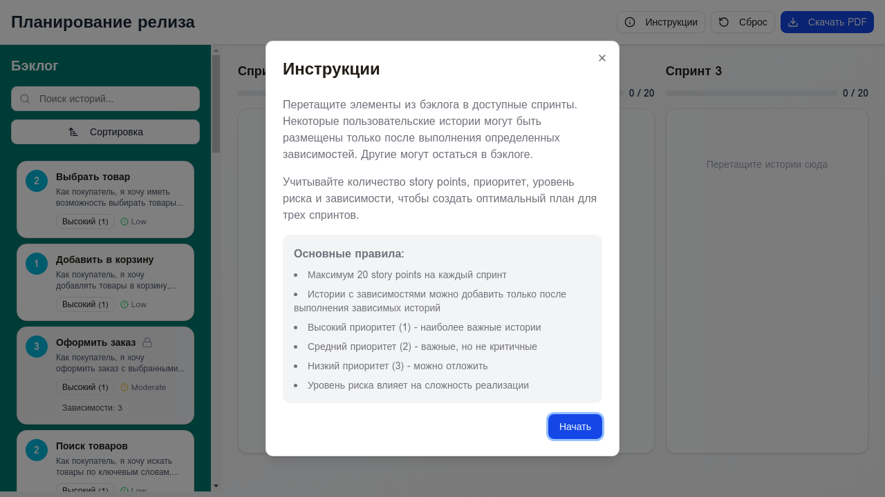

# Симулятор планирования спринтов

Интерактивный веб-симулятор для обучения планированию спринтов в методологии Agile/Scrum. Приложение позволяет пользователям практиковаться в распределении пользовательских историй по спринтам с учетом зависимостей, приоритетов и ограничений по story points.



## 🎯 Возможности

- **Drag & Drop интерфейс** - интуитивное перетаскивание пользовательских историй между бэклогом и спринтами
- **Управление зависимостями** - автоматическая проверка выполнения зависимостей между историями
- **Контроль story points** - ограничение максимум 20 points на каждый спринт с визуальной индикацией
- **Фильтрация и сортировка** - поиск и сортировка историй по приоритету, риску, points и алфавиту
- **Экспорт в PDF** - сохранение плана спринтов в PDF формате
- **Адаптивный дизайн** - работает на desktop, tablet и mobile устройствах
- **Русскоязычный интерфейс** - полностью на русском языке

## 🚀 Быстрый старт

### Запуск с Docker (рекомендуется)

```bash
# Клонировать репозиторий
git clone https://github.com/yourusername/sprint-planning-simulator.git
cd sprint-planning-simulator

# Запустить с помощью Docker Compose
docker-compose up -d

# Приложение будет доступно по адресу http://localhost:3000
```

### Запуск без Docker

```bash
# Установить зависимости
pnpm install

# Запустить dev сервер
pnpm run dev

# Или собрать для production
pnpm run build
pnpm run preview
```

## 🛠 Технологии

- **Frontend Framework**: React 18+ с TypeScript
- **Build Tool**: Vite
- **Styling**: Tailwind CSS
- **UI Components**: shadcn/ui
- **Drag & Drop**: @dnd-kit
- **PDF Generation**: jsPDF + html2canvas
- **Containerization**: Docker + Nginx

## 📦 Структура проекта

```
sprint-planning-simulator/
├── client/
│   ├── src/
│   │   ├── components/      # React компоненты
│   │   ├── contexts/        # React контексты
│   │   ├── data/           # JSON данные с историями
│   │   ├── pages/          # Страницы приложения
│   │   ├── types/          # TypeScript типы
│   │   └── App.tsx         # Главный компонент
│   └── public/             # Статические файлы
├── Dockerfile              # Docker конфигурация
├── docker-compose.yml      # Docker Compose файл
├── nginx.conf             # Nginx конфигурация
└── README.md              # Документация
```

## 🎮 Как использовать

1. **Откройте приложение** - при первом запуске появится модальное окно с инструкциями
2. **Изучите бэклог** - в левой панели отображаются все доступные пользовательские истории
3. **Перетащите истории** - перетаскивайте карточки из бэклога в спринты
4. **Следите за ограничениями**:
   - Максимум 20 story points на спринт
   - Истории с зависимостями доступны только после выполнения зависимых историй
   - Заблокированные истории помечены иконкой замка
5. **Используйте фильтры** - поиск и сортировка помогут найти нужные истории
6. **Экспортируйте результат** - нажмите "Скачать PDF" для сохранения плана

## 🐳 Docker команды

```bash
# Сборка образа
docker build -t sprint-planning-simulator .

# Запуск контейнера
docker run -d -p 3000:80 sprint-planning-simulator

# Остановка контейнера
docker-compose down

# Просмотр логов
docker-compose logs -f

# Пересборка после изменений
docker-compose up -d --build
```

## 🔧 Разработка

```bash
# Установка зависимостей
pnpm install

# Запуск dev сервера с hot reload
pnpm run dev

# Проверка типов TypeScript
pnpm run type-check

# Сборка для production
pnpm run build

# Предпросмотр production сборки
pnpm run preview
```

## 📝 Пользовательские истории

Приложение включает 20 пользовательских историй на тему интернет-магазина:

- **Категория A**: Основные функции (выбор товара, корзина, оформление заказа)
- **Категория B**: Поиск и фильтрация (категории, поиск, изображения, сравнение)
- **Категория C**: Пользовательский контент (оценки, отзывы, избранное, история)
- **Категория D**: Адаптивность (мобильная версия, адаптивный дизайн)
- **Категория E**: Платежи и доставка (онлайн-оплата, отслеживание)
- **Категория F**: Персонализация (уведомления, рекомендации)
- **Категория G**: Поддержка (чат, многоязычность)

Вы можете легко изменить истории, отредактировав файл `client/src/data/userStories.json`.

## 🌐 Деплой

### GitHub Pages

```bash
# Добавить в package.json
"homepage": "https://yourusername.github.io/sprint-planning-simulator"

# Установить gh-pages
pnpm add -D gh-pages

# Добавить скрипт деплоя
"deploy": "pnpm run build && gh-pages -d client/dist"

# Задеплоить
pnpm run deploy
```

### Vercel / Netlify

Просто подключите репозиторий к платформе, и она автоматически определит настройки Vite.

## 📄 Лицензия

MIT License - свободно используйте в образовательных и коммерческих целях.

## 🤝 Вклад в проект

Приветствуются pull requests! Для крупных изменений сначала откройте issue для обсуждения.

## 📧 Контакты

Если у вас есть вопросы или предложения, создайте issue в репозитории.

---

**Создано для обучения Agile/Scrum методологии** 🎓

